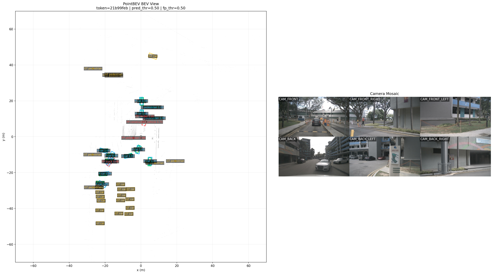

# PointBEV v0

PointBEV v0 - экспериментальный baseline для BEV-детекции на `nuScenes`, где
предсказания строятся вокруг LiDAR-точек и дополняются признаками из нескольких
камер.

## Описание

Модель решает задачу BEV-2D detection: для отобранных LiDAR-точек она
предсказывает `objectness`, класс, смещение центра объекта в BEV, размер
`width/length` и yaw. Камеры используются не как отдельный image-detector, а как
источник point-wise признаков: LiDAR-точка проецируется в видимые камеры,
забирает локальные признаки из image backbone, после чего несколько видов
агрегируются в один признак точки.

LiDAR-часть сделана легкой. Из точек строится BEV stats map с каналами
`count`, `occupied`, `z_max`, `height_range`; небольшой CNN превращает ее в
локальный LiDAR-контекст. Этот контекст используется для дешевого gate и для
геометрической поддержки финальных head-ов.

## Архитектура

```text
nuScenes frame
    |
    |-- LiDAR points
    |     |-- raw point attributes: x, y, z, intensity, range, sin(theta), cos(theta)
    |     |-- BEV stats map: count, occupied, z_max, height_range
    |     `-- TinyLidarFeatureMap -> fine/context LiDAR features
    |
    |-- six camera images
    |     |-- ResNet-18 backbone -> C2, C3, C4, C5
    |     `-- FPN top-down from C5 -> sampled C2, P2, P3, P4, P2_gate
    |
    |-- cheap gate
    |     `-- low-channel P2 center + local LiDAR context
    |
    `-- point head
          |-- obj
          |-- cls
          |-- dx, dy
          |-- dlog_w, dlog_l
          `-- sin_yaw, cos_yaw
```

`C5` используется внутри FPN как верхний top-down источник для построения `P4`.
Отдельный `P5` в текущем коде не возвращается и не сэмплируется для точек.

## Качественный пример

Ниже показан qualitative render для cheap-gate threshold `-0.05`. Это визуальная
проверка поведения модели, а не controlled ablation по порогам.



## Зависимости

```text
torch
torchvision
nuscenes-devkit
numpy
Pillow
tqdm
pyquaternion
```

## Структура

```text
point_bev_nuscenes/
|-- point_bev_v0/
|   |-- __init__.py
|   |-- dataset.py
|   |-- model.py
|   `-- losses.py
|-- docs/
|   `-- assets/
|       `-- point_bev_gate_m005.png
|-- .gitignore
|-- README.md
`-- train.py
```
